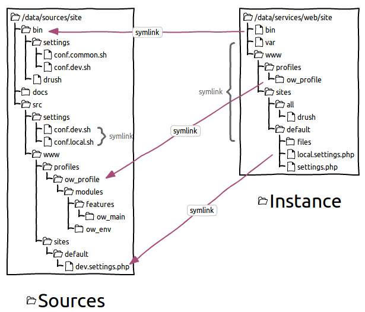

################
Poste de travail
################

Emplacement des sources
=======================

Comme pour eZPublish, les sources sont séparées en 2 :

- ``/data/sources/site`` : code source versionné du projet
- ``/data/services/web/site`` : instance Drupal du projet

Des liens symboliques s'effectuent entre les 2 pour faciliter le développement et le déploiement.

Description de l'arborescence
=============================

- ``bin/`` : submodule Open Wide permettant de déployer un environnement.
    - ``bin/settings/`` : configuration globale + fichiers init de copie d'environnement nécessaire lors de l'install
    - ``bin/vendor/`` : drush (+ autres outils uniquement en local comme le code sniffer, phpmd)
- ``src/`` : code source spécifique
    - ``src/settings/drush/`` : versions de modules/thèmes activés/désactivés selon un environnement
    - ``src/www/profiles/ow_profile/`` : profil d'installation contenant les modules et thèmes spécifiques utilisés sur le site
    - ``src/www/sites/default/`` : configuration spécifique à un environnement (inclus à la fin de ``settings.php``)
- ``www/`` : lien symbolique de l'instance du site Drupal (permet de lancer des commandes drush depuis les sources)

PHP Storm
=========

Code Sniffer
************

Pour coder sur Drupal, il faut développer selon certaines conventions de codage.

Dans le module **coder** se trouve le **PHP Code Sniffer** qui propose toutes les règles d'écriture spécifiques à Drupal.

Restera à la référencer dans votre IDE préféré.

- Aller dans le menu ``Settings > Editor > Inspections``
- Cocher ``PHP > PHP Code Sniffer validation`` puis sélectionner dans les options le *Coding standard* **Custom**
- Parcourir l'arborescence pour aller jusqu'au module Drupal ``coder`` de votre projet (*[PROJECT_DIRECTORY]/www/sites/all/modules/contrib/coder/coder_sniffer/Drupal/*)

- Aller dans le menu ``Settings > Languages & Frameworks > PHP > Code Sniffer``
- Dans le chemin du phpcs, parcourir l'arborescence d'un de vos projets, puis sélectionnez l'exécutable dans le submodule : *[PROJECT_DIRECTORY]/bin/vendor/bin/phpcs*

.. seealso::
    - Paramétrage PHPStorm Drupal : https://www.drupal.org/node/1962108
    - Utilisation de PHPStorm pour Drupal : https://confluence.jetbrains.com/display/PhpStorm/Drupal+Development+using+PhpStorm
    - Installation Code Sniffer : https://confluence.jetbrains.com/display/PhpStorm/PHP+Code+Sniffer+in+PhpStorm

Behat
*****

Installez le plugin **Behat** pour activer la coloration syntaxique des fichiers *.feature*.
