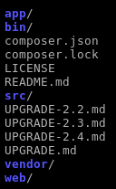

#######################
Architecture de Symfony
#######################

***************************
L'architecture des fichiers
***************************

Dans les sources que nous venons de d'installer, il n'y a pas beaucoup de fichiers :

Voyons à quoi ils correspondent.

Le répertoire */app*
====================

Ce répertoire contient tout ce qui concerne votre application, sauf son code source.

Le code source de votre application implémente ses fonctionnalités. Tout le reste comme la configuration, le cache, les logs, etc., c'est dans le répertoire */app*

Le répertoire */bin*
====================

Ce répertoire n'est pas tout le temps présent. Il contient des exécutables fournis par les bundles. 

Le répertoire */src*
====================

Voici le répertoire dans lequel on mettra notre code source ! Ce code est découpé en *bundles*.

Après l'installation de Symfony, ce répertoire n'est pas vide. Il contient un bundle de démo (Acme) et une ébauche de bundle. Ces deux bundles seront supprimés.

Le répertoire */vendor*
=======================

Ce répertoire contient toutes les librairies externes de notre application comme Symfony, Doctrine, Twig, SwiftMailer, etc.

.. admonition:: Qu'est ce qu'une librairie ?
    :class: hint

    Un librairie est une boite noire qui rempli une fonction bien précise et dont on peut se servir dans notre code. On ne sais pas comment elle fonctionne, mais on sais comment s'en servir.

Le répertoire */web*
====================

Ce répertoire contient tous les fichiers destinés aux visiteurs : image, CSS, Javascript, etc. Il contient également les contrôleurs frontaux ``app.php`` et ``app_dev.php``. C'est le seul répertoire accessible aux visiteurs.

.. admonition:: Contrôleur frontal
    :class: hint

    Le contrôleur front est le point d'entrée par lequel passe toutes les pages. Dans Symfony, il y en a deux : un pour le développement l'autre pour les autres environnement.

Les fichiers */composer.\**
===========================

Le fichier ``composer.json`` contient les instructions destinées à composer pour qu'il installe les librairies externes. À chaque installation ou mise à jour de librairie, il écrit dans le fichier ``composer.lock`` les versions exactes de chaque librairie qu'il a installé. Ensuite, lors du déploiement de l'application sur les autres environnements, comme en production, on pourra installer les mêmes versions que lors des développements grâce à composer.

Les fichiers */\*.md*
=====================

Le reste des fichiers contient de la documentation.

*************************
Architecture conceptuelle
*************************

Maintenant que nous avons vu comment s'organisait les fichiers de Symfony, nous allons voir comment s'organise l'exécution du code.

Architecture MVC
=================

MVC signifie Modèle/Vue/Contrôleur. C'est un découpage très répandu dans les frameworks web. L'idée est d'organiser le code en séparant les données, leurs présentations et leurs traitements. Cette séparation rends les applications, même complexes, plus facile à maintenir et à faire évoluer.
 
Elle se compose de trois couches :
  
Le **contrôleur** (*controller*)
    Son rôle est de générer la réponse à la requête HTTP demandée par le visiteur. Il analyse la requête du visiteur, et utilise les autres composants pour composer la réponse et la renvoie au visiteur.

* Le **modèle** (*model*) 
    Il est responsable des données et de tous les traitements faits sur les données. Rien d'autre dans l'application ne doit manipuler les données afin de garantir leur intégrité.
  
* La **vue** (*vue*)
    Elle est chargée de générer les interfaces utilisateurs, généralement basées sur les données. Elle peut présenter les données sous plusieurs formes : HTML, json, XML, etc.

Déroulement d'une requête dans Symfony
======================================

.. image:: _static/images/symfony_request_flow.png
    :align: center

#. Le visiteur demande une page ;
#. Le **contrôleur frontal** reçoit la requête, charge le **Kernel** et la lui transmet ;
#. Le **Kernel** demande au **Router** quel contrôleur exécuter pour la page demandée ;
#. Le **Kernel** exécute le **contrôleur**.
#. Le **contrôleur** retourne la réponse.

.. admonition:: Le routeur
    :class: hint

    C'est un composant Symfony qui a pour mission de faire la correspondance en les URL et les contrôleurs.

***********
Les bundles
***********

Comme dit précédemment, un bundle contient tout le code source nécessaire pour implémenter la ou les fonctionnalités pour lesquelles il est prévue. Quand on dit tout le code source, il s'agit des contrôleurs, modèles, vues, classes personnelles, etc.
Tout ces éléments sont organisés dans des répertoires comme on peut le voir dans le bundle de démo qui se trouve dans ``Acme/DemoBundle`` :

.. code-block:: bash

    /Controller          | Contient vos contrôleurs
    /DependencyInjection | Contient des informations sur votre bundle (chargement automatique de la configuration par exemple)
    /Entity              | Contient vos modèles
    /Form                | Contient vos éventuels formulaires
    /Resources
    -- /config           | Contient les fichiers de configuration de votre bundle (nous placerons les routes ici, par exemple)
    -- /public           | Contient les fichiers publics de votre bundle : fichiers CSS et JavaScript, images, etc.
    -- /views            | Contient les vues de notre bundle, les templates Twig
    /Tests               | Contient vos éventuels tests unitaires et fonctionnels

