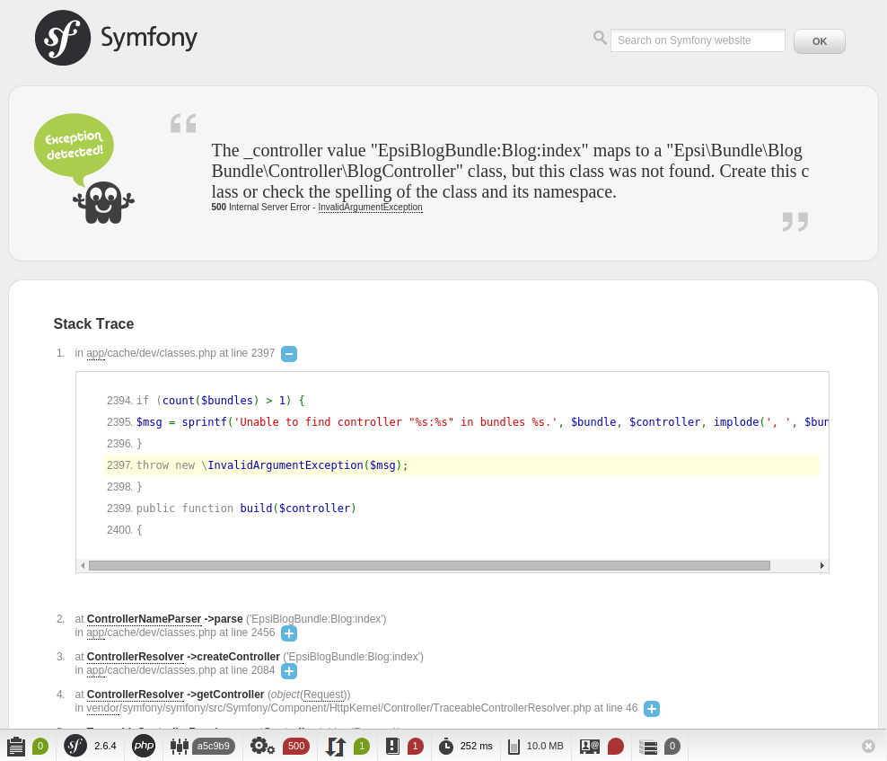

##########
Le routing
##########

Le routing fait la correspondance entre les URLs et les les contrôleurs. La configuration de ce mapping se fait dans les fichiers ``routing.yml`` se trouvant dans le répertoire ``config`` de l'application et des bundles.

Créons les premières routes de notre blog :

.. code-block:: yaml

    # src/Epsi/Bundle/BlogBundle/Resources/config/routing.yml

    epsi_blog_homepage:
        path:      /posts
        defaults:  { _controller: EpsiBlogBundle:Blog:index }
    epsi_blog_show:
        path:      /post/{id}
        defaults:  { _controller: EpsiBlogBundle:Blog:show }
    epsi_blog_add:
        path:      /post/add
        defaults:  { _controller: EpsiBlogBundle:Blog:add } 

.. admonition:: Format de fichiers YAML
    :class: warning

    L'indentation des fichiers YAML se fait avec des espaces et non des indentations.

**************
Fonctionnement
**************

Les routes ci-dessus sont composés de trois éléments :

* un identifiant. Il doit être unique dans l'application, c'est pour cela que l'on reprend les éléments du nom du bundle ;
* un chemin (``path``). C'est URL de la route. Les éléments entre ``{}`` sont des paramètres de l'URL, comme l'ID d'un objet ;
* les paramètres de la route ``defaults`` qui contient notamment le contrôleur à appeler.

Voici comment fonctionne le routeur pas à pas :

#. On appelle l'URL ``/post/5`` ;
#. Le routeur essaie de faire correspondre cette URL avec le ``path`` de la première route. Ici, ``/post/5`` ne correspond pas du tout à ``/posts`` (ligne ``path`` de la première route) ;
#. Le routeur passe donc à la route suivante. Il essaie de faire correspondre ``/post/5`` avec ``/post/{id}``. Cette route correspond, car nous avons bien :    * ``/post`` (URL) = ``/post`` (route) ;
    * ``5`` (URL) = ``{id}`` (route) ;
#. Le routeur s'arrête donc, il a trouvé sa route ;
#. Dans le paramétrage de la route, il trouve quel contrôleur appeler : ``EpsiBlogBundle:Blog:show`` ;
#. Le routeur renvoie donc ces informations au Kernel ;
#. Le noyau va exécuter le contrôleur.

Dans le cas où le routeur ne trouve pas de correspondance pour une URL, il renvoi une erreur 404.

Allons sur la page http://localhost/Symfony/web/app_dev.php/posts :

En haut de la page est affiché un message d'erreur, un exception a été détectée.

Dans la seconde partie, la stack trace. Il s'agit de la liste des fonctions appelées depuis le contrôleur frontal jusqu'à la ligne qui a levé l'exception.

Tout en bas, on trouve le Profiler, un outil de développement où l'on peut trouver de nombreuses informations pouvant aider à la correction de bugs et d'erreurs, ou à l'optimisation. En cliquant sur la barre de profiling, on arrive sur une interface plus complète :

.. image:: _static/images/symfony_profiler.png
    :align: center

*************************************
Convention de nommage des contrôleurs
*************************************

Revenons à vos route. Lors de la configuration des routes dans le fichier ``routing.yml``, les contrôleurs sont spécifiés avec la notation suivante ``EpsiBlogBundle:Blog:index``. Elle est composée de trois éléments :

* ``EpsiBlogBundle`` : le nom du bundle
* ``Blog`` : le nom du contrôleur à ouvrir, en terme de fichier, cela correspond à ``controller/BlogController.php``
* ``index`` : le nom de l'action à exécuter au sein du contrôleur, il s'agit de la fonction ``public function indexAction()`` implémentée dans le contrôleur ``Blog``