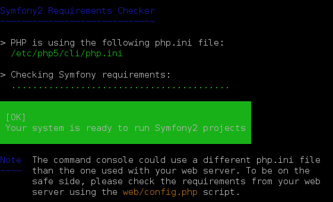

#######################################
Pré-requis et installation du framework
#######################################

.. admonition:: Avant de commencer
    :class: warning

    Cette procédure est donnée pour une installation sur une Ubuntu 10.04. En fonction de la version d'Ubuntu ou de la distribution utilisée, les paquets à installer peuvent être différents.

**********
Pré-requis
**********

* PHP doit être au minimum à la version PHP 5.3.3
* JSON doit être activé
* ctype doit être activé
* Votre PHP.ini doit avoir le paramètre date.timezone défini
    
Installation de MySQL
=====================

.. literalinclude:: code-block/pre-requis_installation/install-php.txt
    :language: bash
    :lines: 1
    

Installation d'Apache
=====================

.. literalinclude:: code-block/pre-requis_installation/install-php.txt
    :language: bash
    :lines: 2
    
Installation de librairies et outils supplémentaires
====================================================

.. literalinclude:: code-block/pre-requis_installation/install-php.txt
    :language: bash
    :lines: 3

Installation de PHP
===================

.. literalinclude:: code-block/pre-requis_installation/install-php.txt
    :language: bash
    :lines: 4

Comme on est sur un post de développement, on installe xDebug :

.. literalinclude:: code-block/pre-requis_installation/install-php.txt
    :language: bash
    :lines: 5

***********************
Installation de Symfony
***********************

Téléchargement de Symfony
=========================

Deux méthodes existent :

* Via le site Symfony http://symfony.com/download
* Via ``Composer``

Nous allons préféré la seconde.

Dans un premier temps, installons ``Composer`` :

.. literalinclude:: code-block/pre-requis_installation/install-symfony.txt
    :language: bash
    :lines: 1-3

.. literalinclude:: code-block/pre-requis_installation/install-symfony.txt
    :language: bash
    :lines: 4
    
``Composer`` va télécharger et installer toutes les librairies nécessaires au fonctionnent de Symfony dans le répertoire ``/var/www/html/Symfony``. il est possible de spécifier une version. S'il n'y en a pas, c'est la dernière version stable qui sera installée.

À la fin l'installation de Symfony, il vous propose une série de question pour le paramétrage :

.. literalinclude:: code-block/pre-requis_installation/install-symfony.txt
    :language: bash
    :lines: 6-18

Tous ces paramètres sont enregistrés dans le fichier ``app/config/parameters.yml``.

Vérifier votre configuration de PHP
===================================

Allez à l'adresse http://localhost/Symfony/web/config.php :

.. image:: _static/images/symfony_config_error.png

Corrigez tous les problèmes avant de continuer :

* Change the permissions of either "app/cache/" or "var/cache/" directory so that the web server can write into it.

    .. literalinclude:: code-block/pre-requis_installation/install-symfony.txt
        :language: bash
        :lines: 20

* Change the permissions of either "app/logs/" or "var/logs/" directory so that the web server can write into it.

    .. literalinclude:: code-block/pre-requis_installation/install-symfony.txt
        :language: bash
        :lines: 21

* Set the "date.timezone" setting in php.ini* (like Europe/Paris).

    .. literalinclude:: code-block/pre-requis_installation/install-symfony.txt
        :language: ini
        :lines: 23-27

* Set "xdebug.max_nesting_level" to e.g. "250" in php.ini

    .. literalinclude:: code-block/pre-requis_installation/install-symfony.txt
        :language: ini
        :lines: 29-30

.. image:: _static/images/symfony_config_success.png

L'installation de Symfony est terminée. Rendez-vous sur la page http://localhost/Symfony/web/app_dev.php/, vous devriez voir une page ressemblant à l'image ci-dessous :

.. image:: _static/images/symfony_homepage_post_install.png

Vérifier la configuration de PHP en console
===========================================

Pour gagner du temps, vous aurez besoin d'exécuter des commandes PHP via la console, vérifions donc que la configuration de PHP soit correcte :

.. literalinclude:: code-block/pre-requis_installation/install-symfony.txt
    :language: bash
    :lines: 32

Correction des droits sur les fichiers
======================================

Afin corriger les droits sur les fichiers une bonne fois pour toute :

* Ajoutons l'utilisateur d'Apache (``www-data``) dans notre groupe

    .. code-block:: bash

        $ sudo usermod -a -G www-data $(whoami)

* Ajoutons dans le groupe ``www-data``

    .. code-block:: bash

        $ sudo usermod -a -G $(whoami) www-data

* Forçons les droits à 775 pour tous les nouveaux fichiers créés par notre utilisateur

    .. code-block:: bash

        # ~/.profile
        umask 002

* Rechargeons notre profil

    .. code-block:: bash

        $ source ~/.profile

* Faisons de même pour www-data

    .. code-block:: bash

        # /etc/init.d/apache2
        do_start()
        {
            # Return
            # ...

            umask 002

* Redémarrons Apache

    .. code-block:: bash

        $ sudo service apache2 restart